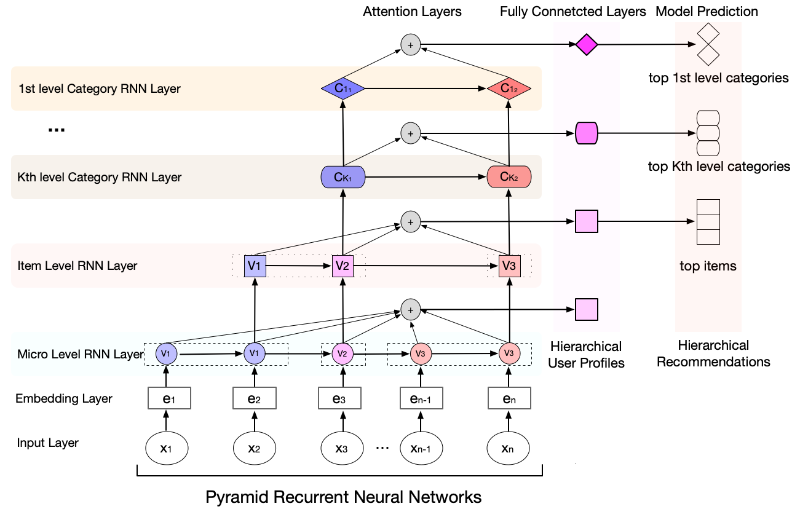

Hierarchical User Profiling for E-commerce Recommender Systems (WSDM 2020)
============

# HUP:

   HUP_code is the code for the paper "[Hierarchical User Profiling for E-commerce Recommender Systems](https://dl.acm.org/doi/abs/10.1145/3336191.3371827)", which is published in WSDM 2020. The code is written in Keras 2.2 and theano 1.0. 

   HUP_Data is the folder that contains the dataset.



## Requirements

python==2.7

keras==2.2.0

theano=1.0.1

numpy=1.13.1

pandas=0.20.3

## Usage

```sh run.sh```

# Datasets:

  JD Micro Behaviors Datasets.

## Description:

The datasets are used for research on modeling users' sequential micro-behaviors in "Hierarchical User Profiling for E-commerce Recommender Systems", which is published in WSDM 2020.

The datasets contain users’ micro-behaviors in two product categories “Appliances” and “Computers”, where each line is a sequence of a user’s micro behaviors in a session. 

## Statistics:


| Dataset | JD-Applicances | JD-Computers | Desc                            |
| ---------- | ---------- | ---------- | ------------------------------- |
| Users | 6,166,916    | 3,191,573 | users                           |
| Products | 169,856 | 419,388 | SKUs            |
| Categories | 103 | 93 | Leaf categories |
| Number of Micro behaviors      | 176,483,033 | 88,766,833 | micro behaviors |

## Research Topics:

This dataset can be used for research on User Profiling, Recommender Systems, Session-based Recommender Systems, Micro-behaviors Modeling, and so on. To protect the privacy of users, we remove the users' information. This dataset should only be used for research purpose!

## Citation:

Please cite the following paper if you use the data in any way.

```
@inproceedings{gu2020hierarchical,
  title={Hierarchical User Profiling for E-commerce Recommender Systems},
  author={Gu, Yulong and Ding, Zhuoye and Wang, Shuaiqiang and Yin, Dawei},
  booktitle={Proceedings of the 13th International Conference on Web Search and Data Mining},
  pages={223--231},
  year={2020}
}
```

## Download link:

The full dataset can be downloaded from https://drive.google.com/open?id=1Fb8J43Fg-HvWxdhMhnDhzUgWqGMlYtqO.

## File Description:

Each line is a sequence of a user’s micro behaviors in a session. 

Each micro-behavior is in the format of "**sku + behavior_type + category + time_interval + dwell_time**", where "SKU" is id of the product, "behavior_type" is the type of micro-behavior, "category“ is the leaf category of the product, time_interval is the time interval between two consecutive micro behiaviors, dwell_time is the dwell time in each product.  

For example, "1993092+7+870+22+27" is a micro-behavior, which means that a user read the specification of product "1993092" (in the leaf category "870"). The time interval between this micro behavior and next micro behavior is 22 seconds. The user spends 27 seconds in this product.

#### SKU:

​       "SKU", which is Short for "Stock Keeping Unit", is the alias of product (i.e. item) in E-commerce.

​       For a SKU "1993092" in the "JD-Applicances" Dataset, the information of the item is in the webpage "https://item.jd.com/1993092.html".

#### behavior_type:

| behavior_type | Micro behaviors      | Description                                  |
| ------------- | -------------------- | -------------------------------------------- |
| 1             | Home2Product         | Browse the product from the homepage         |
| 2             | ShopList2Product     | Browse the product from the category page    |
| 3             | Sale2Product         | Browse the product from the sale page        |
| 4             | Cart2Product         | Browse the product from the carted page      |
| 5             | SearchList2Product   | Browse the product from the searched results |
| 6             | Detail_comments      | Read the comments of the product             |
| 7             | Detail_specification | Read the specification of the product        |
| 8             | Detail_bottom        | Read the bottom of page of the product       |
| 9             | Cart                 | Add the product to the shopping cart         |
| 10            | Order                | Make an order                                |

#### category:

​      It is the leaf category of a product.

#### time_interval:

​      Time intervals is the time between two micro-behaviors.  

​      In the experiments, we discretize them into 5 buckets as following.

| time interval bucket | time interval range |
| -------------------- | ------------------- |
| 1                    | 0~1 seconds         |
| 2                    | 1~15 seconds        |
| 3                    | 15~40 seconds       |
| 4                    | 40~90 seconds       |
| 5                    | 90+ seconds         |


#### dwell_time:

​      Dwell time is the length of time a user spends in an item. 

​      It should be noted that multiple micro behaviors under a product share the same dwell time, during which the user may perform multiple micro-behaivors on the product.

​      In the experiments, we discretize them into 5 buckets as following.

| dwell time bucket | dwell time range |
| ----------------- | ---------------- |
| 1                 | 0~15 seconds     |
| 2                 | 15~40 seconds    |
| 3                 | 40~100 seconds   |
| 4                 | 100~600 seconds  |
| 5                 | 600+ seconds     |


